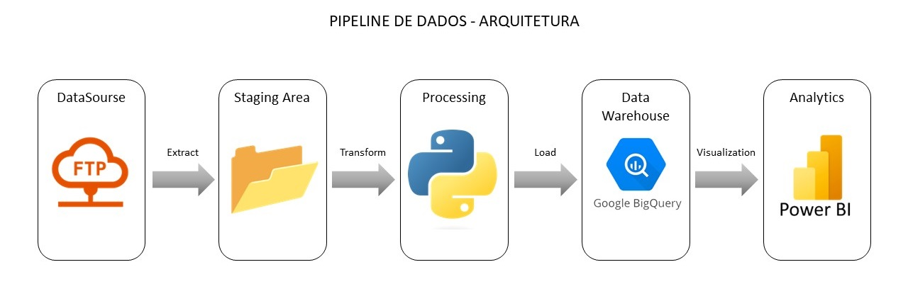

# Data Pipeline para Data Warehouse do Caged

Este projeto tem o objetivo de desenvolver um pipeline de dados para a construção de um Data Warehouse para análise de dados do Caged.

#
## Arquitetura

A arquitetura definida foi mista, sendo o processamento executado on premise e o DW mantido na nuvem. Ela segue o modelo apresentado na imagem abaixo e logo em seguido são detalhadas as ferramentas utilizadas.

#
## Ferramentas

* StarUML: modelagem dimensional e modelo físico de dados
* Python: execução da ETL, realizando a extração dos dados do FTP, transformando e carregando os mesmos no DW;
* BigQuery: foi o banco de dados utilizado para persistir os dados do Data Warehouse;
* PowerBi Desktop: Visualização e análise dos dados
#
### Instalação do StarUML:

* Baixar o instalador em: https://staruml.io/download

### Intalação do Python:

* Baixar o instalador em: https://www.python.org/downloads/

### Instalação do PowerBi Desktop:

* Baixar o instalador em: https://powerbi.microsoft.com/pt-br/desktop/

#
## Modelagem final dos dados

#
## Processo da ETL

#
## Dashboard para a análise dos dados

* Link para acessar: https://app.powerbi.com/view?r=eyJrIjoiNzNmNjdhMjQtOWU5Yi00YWFkLThmNTctZGJkMjQ1MzI3YzY1IiwidCI6ImZhNzk1MzFjLThjZTUtNGJkMy05N2VlLTI0NWU2ZWUyNjZiOCJ9

#